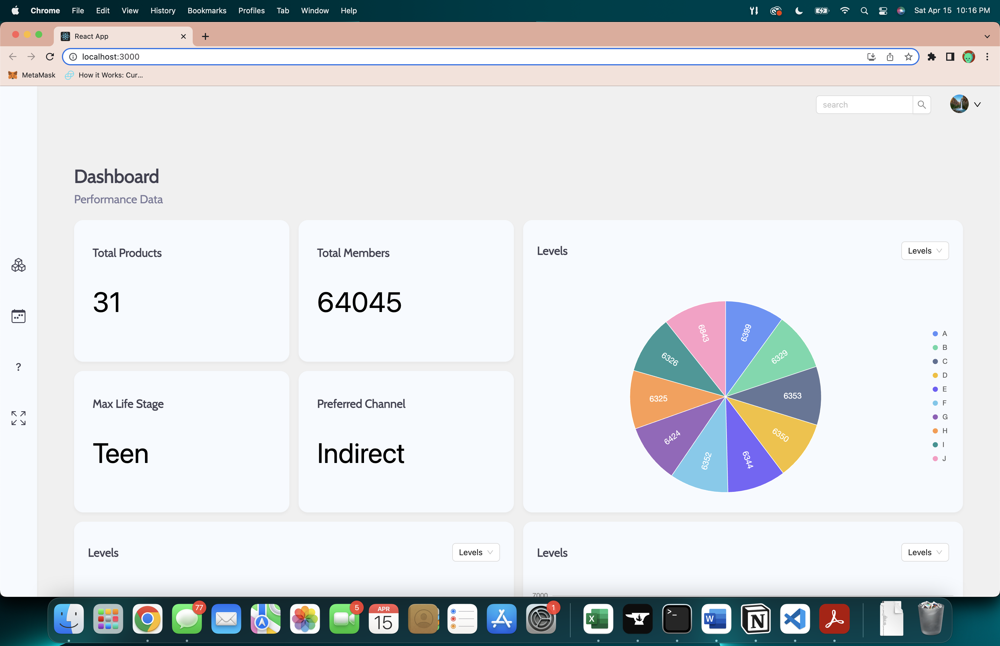

# Credit Dashboard
> A responsive SPA for displaying data concerning a credit union's past year performance.

This app is constructed using React, Ant Design, and Ant Design Charts for the front end
and is capable of displaying up to three different datasets at a time in the three provided
charts in the interface. The app also includes some relevant statistics in the form of four
'widgets', which display data pertaining to specific components of the datasets provided. The
backend for this project is composed of an AWS Lambda function which is itself running through
API Gateway. There are also a couple of different options to style that a user can choose for the style of the
app, such as a classic white interface or a glassmorphic one. 




Changing between these would require going into settings under the user dropdown menu.


## Changes
Additionally, a small change was made to the data structure of the response in altering the 'data'
field from the data type:

```
Data: {
  Levels: {
    XData: string[],
    YData: int[],
    Source: [],
    Target: [],
    Value: []
  },
  CurrentProducts: {
    XData: string[],
    YData: int[],
    Source: [],
    Target: [],
    Value: []
  },
  ...
  PreferredChannels: {
    XData: string[],
    YData: int[],
    Source: [],
    Target: [],
    Value: []
  }
}
```

to the type:

```
Data: [
  {
    Name: <dataset name>,
    XData: string[],
    YData: int[],
    Source: [],
    Target: [],
    Value: []
  }
]
```

in order to allow a greater degree of flexibility in how additional datasets may be
appended to the query.